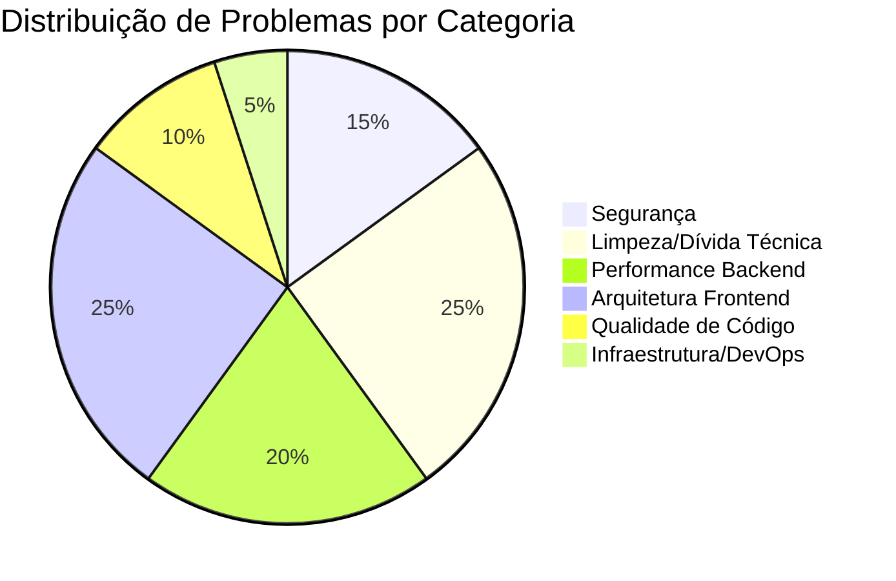

# Plano de Otimização — Sistema Plano de Comunicação (ASCOM/Novacap)

> **Baseado em**: Análise completa de ~130 arquivos-fonte, 5 documentos de planos, configurações e logs
> **Data**: 15/06/2026

---

## Resumo Executivo

O sistema é funcional e impressionantemente abrangente (55+ endpoints, 21 páginas, 14 módulos de IA/NLP), mas acumula dívida técnica em **6 áreas críticas**. Este plano organiza as otimizações em fases por impacto/urgência.



---

## User Review Required

> [!CAUTION]
> **Senha em texto plano no repositório**: O arquivo [.env](file:///f:/@GIT REPOSITORIES/PLANO DE COMUNICAÇAO/backend/.env) contém `MASTER_PASSWORD=ascom2024` e está sendo versionado no Git. Isso é uma vulnerabilidade de segurança **imediata**.

> [!IMPORTANT]
> **5 arquivos HTML legados no root** (~110KB) duplicam funcionalidades do React SPA. Confirme se podem ser removidos:
> - [dashboard.html](file:///f:/@GIT REPOSITORIES/PLANO DE COMUNICAÇAO/dashboard.html) (30KB)
> - [consult-chat.html](file:///f:/@GIT REPOSITORIES/PLANO DE COMUNICAÇAO/consult-chat.html) (17KB)
> - [crisis-panel.html](file:///f:/@GIT REPOSITORIES/PLANO DE COMUNICAÇAO/crisis-panel.html) (33KB)
> - [plan-health.html](file:///f:/@GIT REPOSITORIES/PLANO DE COMUNICAÇAO/plan-health.html) (22KB)
> - [index.html](file:///f:/@GIT REPOSITORIES/PLANO DE COMUNICAÇAO/index.html) (6KB)

> [!WARNING]
> **12 scripts de diagnóstico órfãos** no diretório `backend/` — mistura de `.ts`, `.mjs`, `.cjs` com funcionalidade duplicada. Recomendo mover os úteis para `backend/scripts/` e excluir o restante.

---

## Open Questions

1. **Os HTMLs legados estão em uso em algum lugar?** (ex: algum link interno, bookmark de usuário, iframe?)
2. **Qual é o volume atual de documentos?** (centenas ou milhares?) — impacta a prioridade da otimização O(n²) no similarity.ts
3. **Existe plano de deploy em produção?** (Docker? Servidor Windows local? IIS?) — impacta as recomendações de infra
4. **O tesseract.js (OCR) é usado com frequência?** O arquivo `por.traineddata` (2.4MB) está no Git
5. **Existe necessidade de acesso offline?** — se sim, PWA entra como prioridade

---

## Fase 1 — Segurança e Higiene Crítica (Urgente)

> **Impacto**: 🔴 Crítico | **Esforço**: ~2h | **Risco de não fazer**: Exposição de credenciais

### Segurança

#### [MODIFY] [.gitignore](file:///f:/@GIT REPOSITORIES/PLANO DE COMUNICAÇAO/.gitignore)
- Adicionar: `**/.env`, `*.log`, `*.traineddata`, `scratch/`, `.DS_Store`, `coverage/`, `.vscode/`, `.idea/`
- A regra atual `.env` não cobre `backend/.env` (só raiz)

#### [MODIFY] [backend/.env](file:///f:/@GIT REPOSITORIES/PLANO DE COMUNICAÇAO/backend/.env)
- Remover do Git tracking (`git rm --cached backend/.env`)
- Trocar `MASTER_PASSWORD` para uma senha forte

#### [NEW] backend/.env.example
- Template sem valores sensíveis, com comentários explicativos

### Limpeza de Arquivos

#### [DELETE] Scripts órfãos no backend (12 arquivos, ~10KB)
| Arquivo | Razão |
|---|---|
| `_check_file_count.ts` | Debug one-off |
| `_check_state.mjs` | Debug one-off |
| `_check_tables.ts` | Debug one-off |
| `check_paths.cjs` | Debug one-off |
| `check_queue.cjs` | Debug one-off |
| `check_schema.cjs` | Debug one-off |
| `check_server_db.cjs` | Debug one-off |
| `check_tables.cjs` | Duplicata de `.mjs` |
| `check_tables.mjs` | Duplicata de `.cjs` |
| `verify_db.cjs` | Debug one-off |
| `verify_status.cjs` | Debug one-off |

> Manter `_generate_all.ts` → mover para `backend/scripts/generate_all.ts`

#### [DELETE ou ARCHIVE] HTMLs legados (5 arquivos, ~110KB)
- Mover para `docs/legacy/` ou excluir definitivamente

#### Remover logs do Git
- `git rm --cached` de todos os `.log` files

---

## Fase 2 — Performance do Backend (Alta Prioridade)

> **Impacto**: 🟠 Alto | **Esforço**: ~8h | **Benefício**: Responsividade 3-10x melhor em operações pesadas

### 2.1 Full-Text Search com FTS5

#### [MODIFY] [backend/src/db/connection.ts](file:///f:/@GIT REPOSITORIES/PLANO DE COMUNICAÇAO/backend/src/db/connection.ts)
- Criar tabela virtual FTS5: `CREATE VIRTUAL TABLE IF NOT EXISTS documents_fts USING fts5(raw_text, summary, keywords, content=document_text)`
- Adicionar triggers para sincronização automática

#### [MODIFY] [backend/src/routes/search.ts](file:///f:/@GIT REPOSITORIES/PLANO DE COMUNICAÇAO/backend/src/routes/search.ts)
- Substituir `LIKE '%query%'` por `documents_fts MATCH ?`
- **Impacto**: Busca 10-100x mais rápida em volumes grandes

### 2.2 Scanner Assíncrono

#### [MODIFY] [backend/src/scanner.ts](file:///f:/@GIT REPOSITORIES/PLANO DE COMUNICAÇAO/backend/src/scanner.ts)
- Substituir `fs.readdirSync` / `fs.statSync` por `fs.promises.readdir` / `fs.promises.stat`
- Processar hashes MD5 com `createReadStream` em vez de ler arquivo inteiro na memória
- Adicionar batching para não bloquear o event loop

### 2.3 Cache de Vetores TF-IDF

#### [MODIFY] [backend/src/analysis/semanticSearch.ts](file:///f:/@GIT REPOSITORIES/PLANO DE COMUNICAÇAO/backend/src/analysis/semanticSearch.ts)
- Persistir vetores TF-IDF no banco (nova tabela `document_vectors`)
- Recalcular apenas para documentos novos/modificados
- **Impacto**: Busca semântica de O(n) recálculo para O(1) lookup

#### [MODIFY] [backend/src/analysis/nlpService.ts](file:///f:/@GIT REPOSITORIES/PLANO DE COMUNICAÇAO/backend/src/analysis/nlpService.ts)
- Cachear modelos TF-IDF treinados em memória com invalidação por timestamp

### 2.4 Similaridade Otimizada

#### [MODIFY] [backend/src/analysis/similarity.ts](file:///f:/@GIT REPOSITORIES/PLANO DE COMUNICAÇAO/backend/src/analysis/similarity.ts)
- Atual: O(n²) pairwise comparison → não escala acima de ~500 docs
- Otimizar: calcular similaridade apenas para documentos do mesmo cluster/tipo
- Alternativa: usar LSH (Locality-Sensitive Hashing) para approximate nearest neighbors

### 2.5 Índices de Banco de Dados

#### [MODIFY] [backend/src/db/connection.ts](file:///f:/@GIT REPOSITORIES/PLANO DE COMUNICAÇAO/backend/src/db/connection.ts)
Adicionar índices compostos:
```sql
CREATE INDEX IF NOT EXISTS idx_files_doc_type ON files(doc_type);
CREATE INDEX IF NOT EXISTS idx_files_category ON files(category);
CREATE INDEX IF NOT EXISTS idx_files_last_modified ON files(last_modified);
CREATE INDEX IF NOT EXISTS idx_document_text_status ON document_text(status);
CREATE INDEX IF NOT EXISTS idx_knowledge_relations_source ON knowledge_relations(source_type, source_id);
CREATE INDEX IF NOT EXISTS idx_knowledge_relations_target ON knowledge_relations(target_type, target_id);
CREATE INDEX IF NOT EXISTS idx_processing_queue_status ON processing_queue(status);
CREATE INDEX IF NOT EXISTS idx_document_relations_score ON document_relations(similarity_score);
```

### 2.6 Batching de Queries no Dashboard

#### [MODIFY] [backend/src/routes/dashboard.ts](file:///f:/@GIT REPOSITORIES/PLANO DE COMUNICAÇAO/backend/src/routes/dashboard.ts)
- Consolidar múltiplas queries sequenciais em uma única transação
- Usar `db.transaction()` para agrupar reads

#### [MODIFY] [backend/src/routes/health.ts](file:///f:/@GIT REPOSITORIES/PLANO DE COMUNICAÇAO/backend/src/routes/health.ts)
- Mesmo padrão de batching

---

## Fase 3 — Arquitetura Frontend (Alta Prioridade)

> **Impacto**: 🟠 Alto | **Esforço**: ~12h | **Benefício**: UX mais fluida, menos re-fetches, manutenção mais fácil

### 3.1 Implementar CSS Custom Properties no lugar de Inline Styles

#### [MODIFY] [frontend/src/index.css](file:///f:/@GIT REPOSITORIES/PLANO DE COMUNICAÇAO/frontend/src/index.css)
- Converter todo o design system de [theme.ts](file:///f:/@GIT REPOSITORIES/PLANO DE COMUNICAÇAO/frontend/src/theme.ts) para CSS custom properties:
```css
:root[data-theme="dark"] {
  --bg-primary: #0f0f23;
  --bg-secondary: #1a1a3e;
  --text-primary: #e2e8f0;
  /* ... */
}
:root[data-theme="light"] {
  --bg-primary: #f8fafc;
  --bg-secondary: #ffffff;
  --text-primary: #1e293b;
  /* ... */
}
```

#### [MODIFY] Todas as pages e components
- Substituir `style={{ backgroundColor: theme.colors.bgPrimary }}` por `className="bg-primary"`
- **Impacto**: Elimina ~7.000+ inline style assignments, melhora performance de re-render

### 3.2 Integrar React Query (TanStack Query)

#### [NEW] frontend/src/hooks/useApi.ts
- Custom hooks com React Query para cada endpoint principal
- Cache automático com stale-while-revalidate
- Deduplicação de requests
- Cancelamento automático em unmount

#### [MODIFY] [frontend/src/api.ts](file:///f:/@GIT REPOSITORIES/PLANO DE COMUNICAÇAO/frontend/src/api.ts)
- Configurar `BASE_URL` via `import.meta.env.VITE_API_URL` (variável Vite)
- Adicionar `AbortController` support
- Tipar retornos adequadamente (eliminar `any`)

#### [MODIFY] [frontend/vite.config.ts](file:///f:/@GIT REPOSITORIES/PLANO DE COMUNICAÇAO/frontend/vite.config.ts)
- Adicionar proxy para `/api`:
```ts
server: {
  proxy: {
    '/api': 'http://localhost:3001'
  }
}
```

### 3.3 Decomposição de Componentes Grandes

#### [MODIFY] [frontend/src/App.tsx](file:///f:/@GIT REPOSITORIES/PLANO DE COMUNICAÇAO/frontend/src/App.tsx) (353 linhas)
- Extrair `<AppLayout>` com sidebar + content area
- Extrair `<AppRoutes>` com definições de rotas
- App.tsx fica com ~50 linhas

#### [MODIFY] [frontend/src/components/FlatIcons.tsx](file:///f:/@GIT REPOSITORIES/PLANO DE COMUNICAÇAO/frontend/src/components/FlatIcons.tsx) (683 linhas!)
- Opção A: Dividir em arquivos individuais por ícone (`icons/DashboardIcon.tsx`, etc.)
- Opção B: Usar biblioteca de ícones (Lucide React, React Icons)
- **Impacto**: Reduz o maior arquivo do frontend em 10x

#### Páginas que devem ser decompostas:
| Página | Linhas | Ação |
|---|---|---|
| [DashboardPage.tsx](file:///f:/@GIT REPOSITORIES/PLANO DE COMUNICAÇAO/frontend/src/pages/DashboardPage.tsx) | 536 | Extrair `<StatCard>`, `<RecentFiles>`, `<TypeChart>` |
| [CrisisPanel.tsx](file:///f:/@GIT REPOSITORIES/PLANO DE COMUNICAÇAO/frontend/src/pages/CrisisPanel.tsx) | 479 | Extrair tabs em sub-componentes |
| [OperationalPage.tsx](file:///f:/@GIT REPOSITORIES/PLANO DE COMUNICAÇAO/frontend/src/pages/OperationalPage.tsx) | 467 | Extrair seções |
| [ChatConsultPage.tsx](file:///f:/@GIT REPOSITORIES/PLANO DE COMUNICAÇAO/frontend/src/pages/ChatConsultPage.tsx) | 446 | Extrair `<MessageBubble>`, `<ChatInput>` |
| [DataSourcesPage.tsx](file:///f:/@GIT REPOSITORIES/PLANO DE COMUNICAÇAO/frontend/src/pages/DataSourcesPage.tsx) | 431 | Extrair forms e lista |

### 3.4 Otimizações React

- Adicionar `React.memo` em componentes de lista (Card, Badge, Sidebar items)
- Adicionar `useMemo` para cálculos derivados nas pages
- Adicionar `useCallback` para handlers passados como props
- Virtualizar listas longas (FilesPage, SearchPage) com `react-window` ou `@tanstack/virtual`

---

## Fase 4 — Qualidade de Código (Média Prioridade)

> **Impacto**: 🟡 Médio | **Esforço**: ~6h | **Benefício**: Manutenibilidade, prevenção de bugs

### 4.1 Configurar Linting e Formatação

#### [NEW] .eslintrc.json (raiz)
- ESLint para TypeScript + React
- Rules: no-any, no-unused-vars, consistent-return

#### [NEW] .prettierrc (raiz)
- Formatação consistente

#### [MODIFY] [package.json](file:///f:/@GIT REPOSITORIES/PLANO DE COMUNICAÇAO/package.json) (raiz)
- Scripts: `lint`, `lint:fix`, `format`

### 4.2 Corrigir package.json do Backend

#### [MODIFY] [backend/package.json](file:///f:/@GIT REPOSITORIES/PLANO DE COMUNICAÇAO/backend/package.json)
- Mover `@types/*`, `tsx`, `typescript` para `devDependencies`
- Adicionar scripts de `lint` e `test`

### 4.3 Service Layer no Backend

#### [NEW] backend/src/services/
Extrair lógica de negócios das rotas para serviços:
- `backend/src/services/dashboardService.ts` — lógica de agregação do dashboard
- `backend/src/services/importService.ts` — lógica de importação (atualmente em [import.ts](file:///f:/@GIT REPOSITORIES/PLANO DE COMUNICAÇAO/backend/src/routes/import.ts) com 309 linhas)
- `backend/src/services/consultService.ts` — lógica de consulta IA (atualmente em [consult.ts](file:///f:/@GIT REPOSITORIES/PLANO DE COMUNICAÇAO/backend/src/routes/consult.ts) com 240 linhas)
- `backend/src/services/searchService.ts` — lógica de busca

### 4.4 Melhorar Queue System

#### [MODIFY] [backend/src/queueWorker.ts](file:///f:/@GIT REPOSITORIES/PLANO DE COMUNICAÇAO/backend/src/queueWorker.ts) (335 linhas)
- Implementar retry com exponential backoff (max 3 tentativas)
- Adicionar dead letter queue para falhas persistentes
- Quebrar try/catch monolítico em handlers por estágio
- Adicionar timeout por tarefa (ex: 60s para OCR)

### 4.5 Corrigir tsconfig do Backend

#### [MODIFY] [backend/tsconfig.json](file:///f:/@GIT REPOSITORIES/PLANO DE COMUNICAÇAO/backend/tsconfig.json)
- `moduleResolution`: `"node"` → `"node16"` (compatível com ESM)
- Remover `declaration: true` (não é biblioteca)

---

## Fase 5 — Acessibilidade e UX (Média Prioridade)

> **Impacto**: 🟡 Médio | **Esforço**: ~4h | **Benefício**: Inclusão, compliance com WCAG

### 5.1 Acessibilidade Básica

#### [MODIFY] Todos os componentes interativos
- Adicionar `aria-label` em botões e links
- Adicionar `role` em elementos dinâmicos
- Implementar foco visível (`:focus-visible`)
- Adicionar skip navigation link

### 5.2 Responsividade

#### [MODIFY] [frontend/src/index.css](file:///f:/@GIT REPOSITORIES/PLANO DE COMUNICAÇAO/frontend/src/index.css)
- Adicionar media queries para mobile (< 768px)
- Sidebar colapsável em mobile
- Cards em grid responsivo

### 5.3 Paginação

#### [MODIFY] Pages de lista (FilesPage, SearchPage, ContactsPage)
- Implementar paginação servidor-side
- Backend: adicionar `LIMIT/OFFSET` nas queries sem paginação

---

## Fase 6 — Infraestrutura e DevOps (Baixa Prioridade)

> **Impacto**: 🟢 Baixo a médio | **Esforço**: ~2h | **Benefício**: Reprodutibilidade, confiabilidade

### 6.1 Scripts Cross-Platform

#### [MODIFY] [start.bat](file:///f:/@GIT REPOSITORIES/PLANO DE COMUNICAÇAO/start.bat)
- Criar equivalente `start.sh` para Linux/Mac
- Ou: mover lógica para npm scripts

### 6.2 Testes Automatizados

#### [NEW] backend/src/__tests__/
- Testes unitários para módulos críticos: `classifier.ts`, `entityExtractor.ts`, `nlpService.ts`
- Testes de integração para rotas: `search`, `import`, `consult`

#### [NEW] frontend/src/__tests__/
- Testes de componentes: `Sidebar`, `Card`, `ErrorBoundary`
- Testes de integração de páginas com MSW (Mock Service Worker)

---

## Resumo de Impacto por Fase

| Fase | Prioridade | Esforço | Impacto na Performance | Impacto na Segurança | Impacto na Manutenção |
|---|---|---|---|---|---|
| **1. Segurança & Higiene** | 🔴 Urgente | ~2h | ⬜ Baixo | ⬛ Crítico | ⬛ Alto |
| **2. Performance Backend** | 🟠 Alta | ~8h | ⬛ Crítico (3-100x) | ⬜ Baixo | 🟧 Médio |
| **3. Arquitetura Frontend** | 🟠 Alta | ~12h | 🟧 Médio-Alto | ⬜ Baixo | ⬛ Alto |
| **4. Qualidade de Código** | 🟡 Média | ~6h | ⬜ Baixo | 🟧 Médio | ⬛ Alto |
| **5. Acessibilidade/UX** | 🟡 Média | ~4h | ⬜ Baixo | ⬜ Baixo | 🟧 Médio |
| **6. Infra/DevOps** | 🟢 Baixa | ~4h | ⬜ Baixo | 🟧 Médio | 🟧 Médio |

**Total estimado**: ~36 horas de trabalho

---

## Verification Plan

### Automated Tests
```bash
# Após Fase 4.3
cd backend && npm test

# Após Fase 3.2
cd frontend && npm test
```

### Manual Verification
- **Fase 1**: Verificar que `git status` não mostra `.env`, logs ou scripts removidos
- **Fase 2**: Benchmark de busca antes/depois com `console.time` no endpoint `/api/search`
- **Fase 3**: Chrome DevTools → Performance tab → comparar re-renders antes/depois
- **Fase 5**: Lighthouse accessibility score ≥ 80
